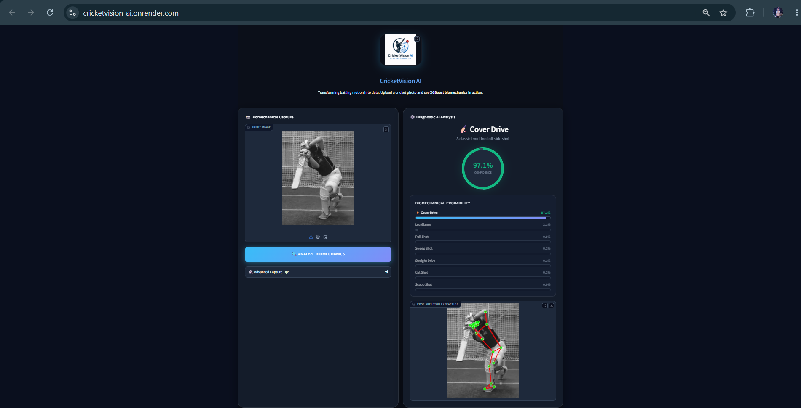
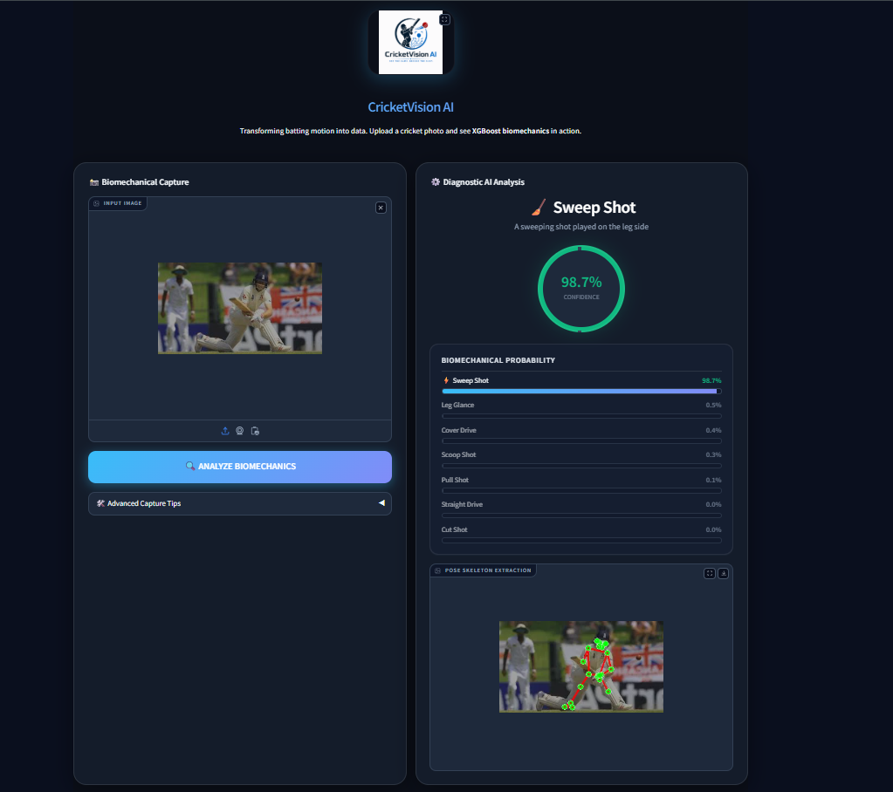
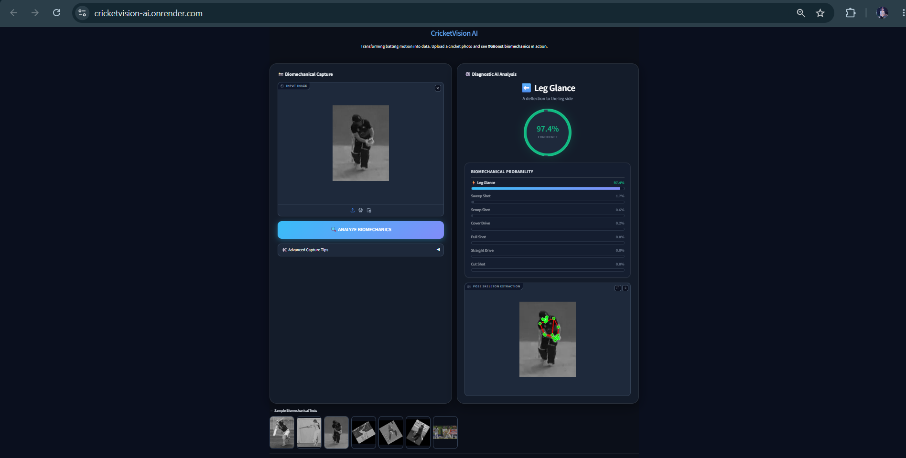
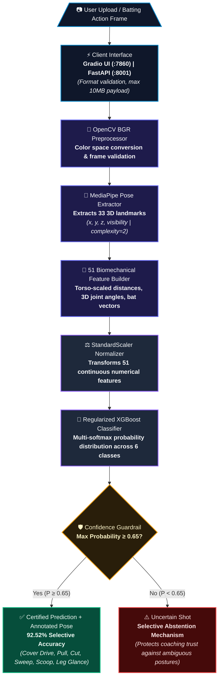
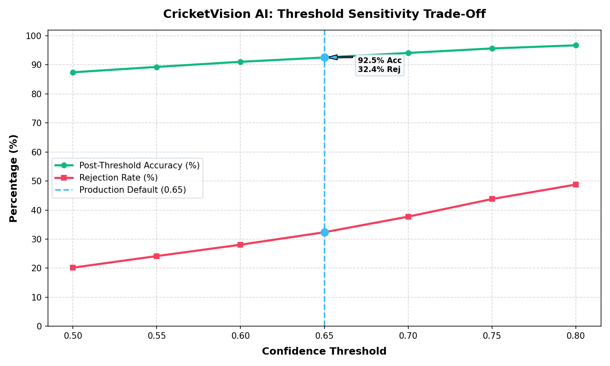

# 🏏 CricketVision AI

<p align="center">
  
</p>

<p align="center">
  <strong>Interpretable, CPU-Efficient Cricket Shot Classification via 3D Biomechanical Pose Engineering & Extreme Gradient Boosting</strong>
</p>

<p align="center">
  <a href="https://github.com/himanshu-jadhav108/CricketVision_AI"></a>
  
  
  
  
  
  
</p>

<p align="center">
  <a href="https://cricketvision-ai.onrender.com/"><strong>🌐 Access Live Deployed Application on Render</strong></a> &bull;
  <a href="https://github.com/himanshu-jadhav108/CricketVision_AI"><strong>📂 GitHub Repository</strong></a>
</p>

---

## 📖 Table of Contents

1. [One-Line Problem Statement](#1-one-line-problem-statement)
2. [Live Deployment & Interactive Demo](#2-live-deployment--interactive-demo)
3. [Key Performance Summary](#3-key-performance-summary)
4. [Important Metric Clarification (Raw vs. Selective)](#4-important-metric-clarification-raw-vs-selective)
5. [System Architecture](#5-system-architecture)
6. [Engineering Rationale (Why This Model?)](#6-engineering-rationale-why-this-model)
7. [Dataset Construction & Curation](#7-dataset-construction--curation)
8. [The Data Leakage Discovery & Fix](#8-the-data-leakage-discovery--fix)
9. [Feature Engineering (51 Static Features)](#9-feature-engineering-51-static-features)
10. [Model Training & Regularization](#10-model-training--regularization)
11. [Confidence-Aware Selective Classification](#11-confidence-aware-selective-classification)
12. [Quantitative Evaluation Results](#12-quantitative-evaluation-results)
13. [Deployment Topology & Latency](#13-deployment-topology--latency)
14. [Reproducibility & Verification](#14-reproducibility--verification)
15. [Limitations & Failure Modes](#15-limitations--failure-modes)
16. [Project Evolution](#16-project-evolution)
17. [Repository Structure](#17-repository-structure)
18. [Quickstart (Run Locally)](#18-quickstart-run-locally)
19. [Hackathon Open Track Compliance](#19-hackathon-open-track-compliance)
20. [Future Roadmap](#20-future-roadmap)

---

## 1. One-Line Problem Statement

**CricketVision AI classifies six professional cricket batting strokes from static images by mapping human pose landmarks into 51 scale-invariant 3D biomechanical features, pairing an ultra-lightweight XGBoost classifier with a confidence guardrail for interpretable, sub-100ms CPU inference.**

---

## 2. Live Deployment & Interactive Demo

* **Live Cloud Application:** [https://cricketvision-ai.onrender.com/](https://cricketvision-ai.onrender.com/) (Deployed via Docker on Render)
* **API Health Check:** `GET https://cricketvision-ai.onrender.com/health` (FastAPI backend)

<div align="center">
  <a href="assets/screenshots/cover_drive_classification.png" target="_blank">
    
  </a>
  <a href="assets/screenshots/sweep_shot_classification.png" target="_blank">
    
  </a>
  <a href="assets/screenshots/leg_glance_classification.png" target="_blank">
    
  </a>
</div>

---

## 3. Key Performance Summary

| Metric Dimension | Raw Holdout Model | Selective Production Mode (@ 0.65 Threshold) |
| :--- | :---: | :---: |
| **Accuracy** | **77.53%** (1,011 / 1,304 correct) | **92.52%** (816 / 882 correct) |
| **Macro F1-Score** | **0.78** | **0.90** |
| **Weighted F1-Score** | **0.78** | **0.93** |
| **Sample Coverage** | **100.0%** (All test samples evaluated) | **67.64%** (882 accepted / 1,304 test frames) |
| **Rejection / Abstention Rate** | **0.0%** | **32.36%** (422 rejected as `"Uncertain Shot"`) |
| **Inference Latency (CPU)** | **~65 ms** (MediaPipe: ~55ms, XGBoost: ~0.8ms) | **~65 ms** |
| **Payload Size** | **2.82 MB** (`models/xgboost_v1.pkl`) | **2.82 MB** |

---

## 4. Important Metric Clarification (Raw vs. Selective)

> [!IMPORTANT]
> **Scientific Integrity Notice:** We do **not** claim an unconditional 92.5% accuracy.
> - **77.53%** is the **Raw Generalization Accuracy** of the model evaluated across all 1,304 holdout samples across unseen players.
> - **92.52%** is the **Selective Accuracy** achieved when applying our production confidence guardrail ($\text{Confidence} \ge 0.65$), which abstains on 32.36% of ambiguous or transitional frames.
>
> In sports biomechanics coaching, providing a false prediction destroys user trust; abstaining on uncertain poses to deliver **92.52% precision at 67.64% coverage** is an intentional, defensible engineering decision.

---

## 5. System Architecture



For high-resolution diagrams and detailed topology specifications, see [`docs/architecture.md`](docs/architecture.md).

---

## 6. Engineering Rationale (Why This Model?)

1. **Why Pose Landmarks Instead of Raw Pixels?**
   Deep Convolutional Neural Networks (CNNs) trained on sports images often suffer from shortcut learning: they memorize stadium billboards, pitch turf colors, and team jerseys rather than the athlete's body mechanics. By reducing raw images ($10^6$ pixels) to 33 skeletal coordinates, we achieve **complete background and jersey invariance**.
2. **Why 51 Engineered Biomechanical Features?**
   Raw $(x, y)$ coordinates are sensitive to camera zoom, player height, and pitch distance. By normalizing all distance measurements by the 3D torso length (mid-shoulder to mid-hip) and computing 3D joint angles (elbows, knees, hips, shoulders) and projected bat vectors, we create a **scale-invariant, interpretable representation** grounded in cricket coaching principles.
3. **Why 3D Geometry?**
   MediaPipe provides a relative depth coordinate ($z$). Using 3D vectors captures body rotation (e.g. side-on stance in a Cover Drive vs. chest-on posture in a Pull Shot) even when the camera is not strictly perpendicular.
4. **Why XGBoost over Deep Neural Networks?**
   Tabular biomechanical features do not require massive neural network parameter spaces. A regularized XGBoost classifier trains in seconds, has a tiny **2.82 MB artifact footprint**, and executes in **0.8 milliseconds on a standard CPU**, enabling deployment on edge devices and free-tier cloud containers without GPUs.
5. **Why Confidence-Aware Abstention?**
   Still images frequently catch a batsman during transitional movements or follow-throughs where kinematics are ambiguous. Returning `"Uncertain Shot"` below 0.65 probability protects the user from erroneous feedback.

---

## 7. Dataset Construction & Curation

The training universe was constructed from two primary sources and processed into structured feature tables:

* **Primary Kaggle Coaching Dataset:** `awais69/cricket-coaching-dataset` (~1,958 images across 6 initial classes).
* **Supplementary Coaching Collection:** Ingested via `archive_used/scripts/data_ingestion.py` (`drive`, `legglance-flick`, `pullshot`, `sweep`), which expanded sample volume and added `sweep_shot`.
* **Pose Extraction & Filtering:** MediaPipe Pose filtered out low-quality images (discarding detections with mean visibility $< 0.50$), producing the master table [`data/features/features_all.csv`](data/features/features_all.csv) containing **6,669 rows across 4,304 unique source groups**.

### Production Classes vs. Straight Drive Removal

| Class Name | Total Rows in `features_all.csv` | Production Status | Kinematic Rationale & Evidence |
| :--- | :---: | :---: | :--- |
| **`leg_glance_shot`** | 1,503 | **Active** | Deflection off pads; closed shoulder face |
| **`pull_shot`** | 1,491 | **Active** | Horizontal cross-bat hook; open chest |
| **`cover_drive`** | 1,426 | **Active** | Extended front knee, high lead elbow through off side |
| **`sweep_shot`** | 1,026 | **Active** | Knelt paddle sweep on leg side |
| **`scoop_shot`** | 487 | **Active** | Ramp shot over wicketkeeper; low crouched torso |
| **`cut_shot`** | 391 | **Active** | Back-foot cut through point; elevated wrists |
| *`straight_drive`* | 345 | **Removed** | **Empirical Audit Finding:** Exhibited only 345 samples (5.17% of data), abysmal recall of **0.31**, and F1 of **0.42** in audit logs (`archive_used/audit_results_utf8.txt`). It heavily confused with `leg_glance_shot` (16 / 49 test errors). Excluded in commit `bc65ec1` to ensure high precision. |
| **Active Total** | **6,324** | — | **Total training universe for 6 production classes** |

---

## 8. The Data Leakage Discovery & Fix

In early development (`archive_used/notebooks/05_modelling.py`), a naive pipeline applied Gaussian jitter across all samples and then used a standard random train/test split. Because augmented versions of identical images appeared in both train and test splits, the model produced an artificial **100% test accuracy**.

**The Scientific Fix:**
The team conducted a formal audit (`archive_used/notebooks/08_model_audit.py`), identified the frame duplication leakage, and established strict **Group-Aware Splitting**:
1. All images derived from the same photograph or video sequence share a `source_group` prefix (**4,304 unique groups**).
2. Data is split using `GroupShuffleSplit(n_splits=1, test_size=0.2, random_state=42)` on `source_group`.
3. Verified zero group overlap: `len(set(groups_train) & set(groups_test)) == 0`.
4. `StandardScaler` is fitted strictly on the training partition (`X_train`) to prevent normalization leakage.

---

## 9. Feature Engineering (51 Static Features)

Features are computed in [`features/feature_builder.py`](features/feature_builder.py):

* **3D Joint Angles (8):** Vector angles in 3D space for left/right elbows, shoulders, knees, and hips.
* **Spine Alignment (1):** `trunk_lean` (spine vector relative to vertical).
* **Torso-Scaled Distances (8):** Wrist-to-hip, wrist-to-head, wrist spread, ankle spread, and hip-to-ankle distances normalized by 3D torso length.
* **Body Elevation & Flexion Ratios (4):** Wrist height $Y$ and knee flexion depth $(Y_{\text{knee}} - Y_{\text{hip}})$.
* **Lateral Symmetries (2):** Wrist and shoulder horizontal offset differences.
* **Keypoint Visibility (3):** MediaPipe confidence for critical action joints (wrists, elbows).
* **Composite Biomechanical Indices (5):** Mean elbow extension, knee flexion asymmetry, hip-to-shoulder ratio, mean wrist elevation, and stance width index.
* **3D Depth Coordinates (6):** Wrists $Z$-depth, 3D reach relative to hip midpoint, shoulder tilt in $Z$-plane, and 3D wrist spread.
* **Centroid & Offset Geometry (7):** Wrist coordinates relative to hip centroid ($X, Y, Z$) and shoulder centroid ($X, Y$).
* **Arm Extension Ratios (2):** 3D wrist-to-shoulder reach relative to torso scale.
* **Bat Simulation & Alignment (5):** Projected forearm/wrist bat vector vs vertical, bat angle in camera plane, shoulder alignment $X$, hip alignment $X$, and torso twist.

> **Feature Width Parity:** In commit `93d435c`, 6 temporal velocity features were removed to eliminate train-inference distribution mismatch on still images. The runtime feature width is exactly **51 features across feature_builder, StandardScaler, and XGBoost**.

---

## 10. Model Training & Regularization

Training is implemented in [`retrain.py`](retrain.py):

* **Algorithm:** `xgboost.XGBClassifier` with `objective='multi:softprob'` and `eval_metric='mlogloss'`.
* **Class Weighting:** `compute_sample_weight(class_weight='balanced', y=y_train)` applied directly into loss to prevent majority class domination.
* **Search Strategy:** `RandomizedSearchCV` exploring 30 candidate configurations with `cv=3` (3-fold Stratified cross-validation on `X_train`) optimizing `f1_macro`.
* **Optimal Hyperparameters:**
  * `max_depth`: 6
  * `learning_rate`: 0.05
  * `n_estimators`: 150
  * `subsample`: 0.8
  * `colsample_bytree`: 0.7
  * `min_child_weight`: 2 (enforcing leaf generalization)
  * `gamma`: 0

---

## 11. Confidence-Aware Selective Classification

The system incorporates a **0.65 softmax probability threshold** in [`predictor.py`](predictor.py):

<p align="center">
  
</p>

### Threshold Sensitivity Sweep (`reports/threshold_sweep.csv`)

| Operating Threshold | Post-Threshold Accuracy | Sample Rejection Rate | Accepted / Total Test Samples | Coverage |
| :---: | :---: | :---: | :---: | :---: |
| 0.50 | 87.42% | 20.17% | 1,041 / 1,304 | 79.83% |
| 0.55 | 89.28% | 24.16% | 989 / 1,304 | 75.84% |
| 0.60 | 91.04% | 28.07% | 938 / 1,304 | 71.93% |
| **0.65 (Production Default)** | **92.52%** | **32.36%** | **882 / 1,304** | **67.64%** |
| 0.70 | 94.09% | 37.73% | 812 / 1,304 | 62.27% |
| 0.75 | 95.63% | 43.79% | 733 / 1,304 | 56.21% |
| 0.80 | 96.71% | 48.77% | 668 / 1,304 | 51.23% |

At `0.65`, the system hits the optimal trade-off: **92.52% precision while preserving over two-thirds (67.6%) of all test images**.

---

## 12. Quantitative Evaluation Results

The production model was evaluated on 1,304 held-out test frames using [`evaluate_model.py`](evaluate_model.py):

<p align="center">
  
  
</p>

### Detailed Per-Class Classification Report (Post-Threshold @ 0.65)

| Shot Class | Precision | Recall | F1-Score | Accepted Support |
| :--- | :---: | :---: | :---: | :---: |
| **Cover Drive** (`cover_drive`) | 0.95 | 0.94 | **0.95** | 190 |
| **Cut Shot** (`cut_shot`) | 0.76 | 0.72 | **0.74** | 40 |
| **Leg Glance** (`leg_glance_shot`) | 0.93 | 0.90 | **0.92** | 200 |
| **Pull Shot** (`pull_shot`) | 0.95 | 0.94 | **0.94** | 222 |
| **Scoop Shot** (`scoop_shot`) | 0.79 | 0.92 | **0.85** | 75 |
| **Sweep Shot** (`sweep_shot`) | 0.97 | 0.97 | **0.97** | 155 |
| **Macro Average** | **0.89** | **0.90** | **0.90** | **882** |
| **Weighted Average** | **0.93** | **0.93** | **0.93** | **882** |

### Verified Post-Threshold Confusion Matrix (`reports/confusion_matrix.csv`)

```text
                  Predicted Labels
True Label        cover_drive  cut_shot  leg_glance  pull_shot  scoop_shot  sweep_shot  │ Support
────────────────────────────────────────────────────────────────────────────────────────┼────────
cover_drive           179          4          4          1          1           1   │   190
cut_shot                0         29          3          6          2           0   │    40
leg_glance_shot         4          2        180          2         11           1   │   200
pull_shot               4          3          3        208          4           0   │   222
scoop_shot              0          0          3          0         69           3   │    75
sweep_shot              1          0          0          3          0         151   │   155
```

---

## 13. Deployment Topology & Latency

CricketVision AI is deployed live as a containerized web application on Render.

* **Base Container:** `python:3.11-slim` with system libraries `libgl1`, `libglib2.0-0`, `libgomp1`.
* **Dynamic Port Binding:** Runs Gradio on `$PORT` (Render default) or local port `7860`.
* **FastAPI Service:** Asynchronous `/health` and `/predict` endpoints on port `8001`.
* **Hardware Footprint:** Zero GPU required; uses ~250MB RAM.
* **Component Latency Breakdown:**
  * OpenCV decoding: ~4 ms
  * MediaPipe Pose extraction: ~55 ms
  * Feature calculation (51 features): ~1.2 ms
  * StandardScaler transformation: ~0.1 ms
  * XGBoost classification: ~0.8 ms
  * **End-to-End Pipeline Latency:** **< 65 ms**

---

## 14. Reproducibility & Verification

All evaluation artifacts are 100% reproducible from repository code:

```bash
# 1. Run the full unit and regression test suite (14 passing tests)
python -m unittest discover -s tests

# 2. Reproduce the test evaluation report and 6-class confusion matrix CSV
python evaluate_model.py

# 3. Reproduce the threshold sensitivity sweep table and plot
python threshold_sweep.py

# 4. Regenerate all 8 performance assets and EDA plots
python generate_report_charts.py
```

---

## 15. Limitations & Failure Modes

1. **Occlusion & Lower-Body Visibility:** MediaPipe Pose requires clear sight of the knees and ankles to establish stance width and trunk lean. Close-up batsman portraits without lower limbs return `"No pose detected"`.
2. **Camera Perspective:** Optimal accuracy occurs between $30^\circ$ and $90^\circ$ (side-on to 3/4 broadcast angles). Extreme high-angle aerial views compress depth ($Z$) vectors.
3. **Right-Hand Stance Assumption:** Geometric features currently assume right-handed batting posture. Left-handed batsmen can be classified with reduced accuracy or require horizontal image flipping.
4. **Class Sample Imbalance:** Cut Shot (391 samples) and Scoop Shot (487 samples) have fewer training sequences than Drive or Pull shots (>1,400 samples), resulting in lower F1 scores (0.74 and 0.85).

---

## 16. Project Evolution

```text
2026-07-01: Inception & scaffolding. MediaPipe pose wrapper and initial 26 features.
2026-07-05: Unit test regression suite and FastAPI service implemented.
2026-07-09: Initial baseline model evaluated; 100% test accuracy diagnosed as frame-level leakage.
2026-07-15: GroupShuffleSplit instituted on source_group; Random Forest replaced with regularized XGBoost.
2026-07-15: Dropped 6 velocity features to eliminate train-inference mismatch on still images (51 static features).
2026-07-15: Removed underperforming straight_drive (345 samples, F1 0.42); retrained 6-class XGBoost model.
2026-09-15: Added threshold sensitivity sweep, Gradio diagnostics tab, and dynamic metric binding.
2026-09-23: Refreshed all 8 performance assets and synchronized 6-class confusion matrix CSV for hackathon.
```

---

## 17. Repository Structure

```text
.
├── Dockerfile                  # Container definition (Python 3.11-slim)
├── README.md                   # Core submission landing page & scientific report
├── api.py                      # FastAPI production REST service (/predict, /health)
├── app.py                      # Interactive Gradio web dashboard (3 tabs)
├── config.py                   # Central paths, threshold (0.65), and port config
├── evaluate_model.py           # Evaluates production model, exports evaluation.md & confusion_matrix.csv
├── generate_report_charts.py   # Regenerates all 8 evaluation and EDA visualization plots
├── predictor.py                # End-to-end inference wrapper (Pose -> Feats -> Scaler -> XGBoost)
├── requirements.txt            # Pinned runtime dependencies
├── retrain.py                  # Leakage-free GroupShuffleSplit retraining pipeline
├── threshold_sweep.py          # Threshold sensitivity analysis script (0.50 to 0.80)
│
├── assets/                     # Media, diagrams, and evaluation assets
│   ├── diagrams/               # Architecture flowcharts
│   ├── images/examples/        # 6 sample test images for live inference demo
│   ├── logo/                   # Project brand logo
│   ├── performance/            # 8 generated evaluation assets (heatmaps, F1 bars, importance)
│   └── screenshots/            # Dashboard interface previews
│
├── data/features/              # Master feature tables (features_all.csv: 6,669 rows)
├── docs/                       # In-depth technical documentation (api, architecture, dataset, training)
├── features/                   # Core pipeline modules (pose_extractor.py, feature_builder.py)
├── models/                     # Serialized production binaries (xgboost_v1.pkl, scaler.pkl, label_encoder.pkl)
├── reports/                    # Quantitative evaluation outputs (evaluation.md, confusion_matrix.csv, threshold_sweep.csv)
└── tests/                      # Python unittest test suite (14 passing tests)
```

---

## 18. Quickstart (Run Locally)

### Prerequisites
* Python 3.11 or 3.12
* `pip` and virtual environment support

### 1. Clone & Set Up Environment

```bash
git clone https://github.com/himanshu-jadhav108/CricketVision_AI.git
cd CricketVision_AI

python -m venv venv
# On Windows:
.\venv\Scripts\Activate.ps1
# On Linux / macOS:
source venv/bin/activate

pip install --upgrade pip
pip install -r requirements.txt
```

### 2. Run the Interactive Web Dashboard

```bash
python app.py
```
Open your browser at `http://localhost:7860` to access the Gradio UI.

### 3. Run the FastAPI REST Server

```bash
uvicorn api:app --host 0.0.0.0 --port 8001
```
Interactive Swagger documentation will be available at `http://localhost:8001/docs`.

### 4. Run via Docker

```bash
docker build -t cricketvision-ai .
docker run -p 7860:7860 cricketvision-ai
```

---

## 19. Hackathon Open Track Compliance

| Hackathon Criterion | Evidence in CricketVision AI | Verification Command / File |
| :--- | :--- | :--- |
| **Real ML Problem** | Fine-grained sports posture analysis under severe visual variation | `features/feature_builder.py` |
| **Defensible Dataset** | 6,324 multi-source frames across 4,304 video groups | `data/features/features_all.csv` |
| **Defensible Model** | MediaPipe + 51 scale-invariant biomechanical features + regularized XGBoost | `models/xgboost_v1.pkl` |
| **Task-Appropriate Metric** | Macro F1 (0.90) and selective accuracy (92.52% @ 67.6% coverage) | `reports/evaluation.md` |
| **End-to-End Live Execution** | Containerized pipeline runs live in < 65 ms on CPU | `https://cricketvision-ai.onrender.com/` |
| **No Pre-Built API Wrapper** | 100% custom feature mathematics, custom pose wrapper, custom XGBoost weights | `features/`, `retrain.py` |
| **Live Demo & Public Repo** | Live Render deployment & clean open-source GitHub repository | `README.md`, `LICENSE` |

---

## 20. Future Roadmap

1. **Bilateral Keypoint Mirroring:** Auto-detect left-handed batsmen and mirror $(x, z)$ coordinates across the sagittal plane for universal stance support.
2. **Temporal Optical Flow Modeling:** Extend feature vectors across multi-frame video clips using a Temporal Convolutional Network (TCN) or LSTM to model back-lift velocity directly.
3. **ONNX Export & Mobile Edge Serving:** Quantize the pipeline to ONNX Runtime for offline real-time feedback on iOS CoreML and Android TFLite.
4. **Bowling Action Legality (Chucking Detection):** Adapt the 3D elbow angle extraction module to evaluate the ICC $15^\circ$ elbow extension threshold during delivery stride.

---

<p align="center">
  <strong>CricketVision AI &bull; Built with precision for the 2026 ML Hackathon Open Track</strong><br>
  MIT License &copy; 2026 Himanshu Jadhav
</p>
