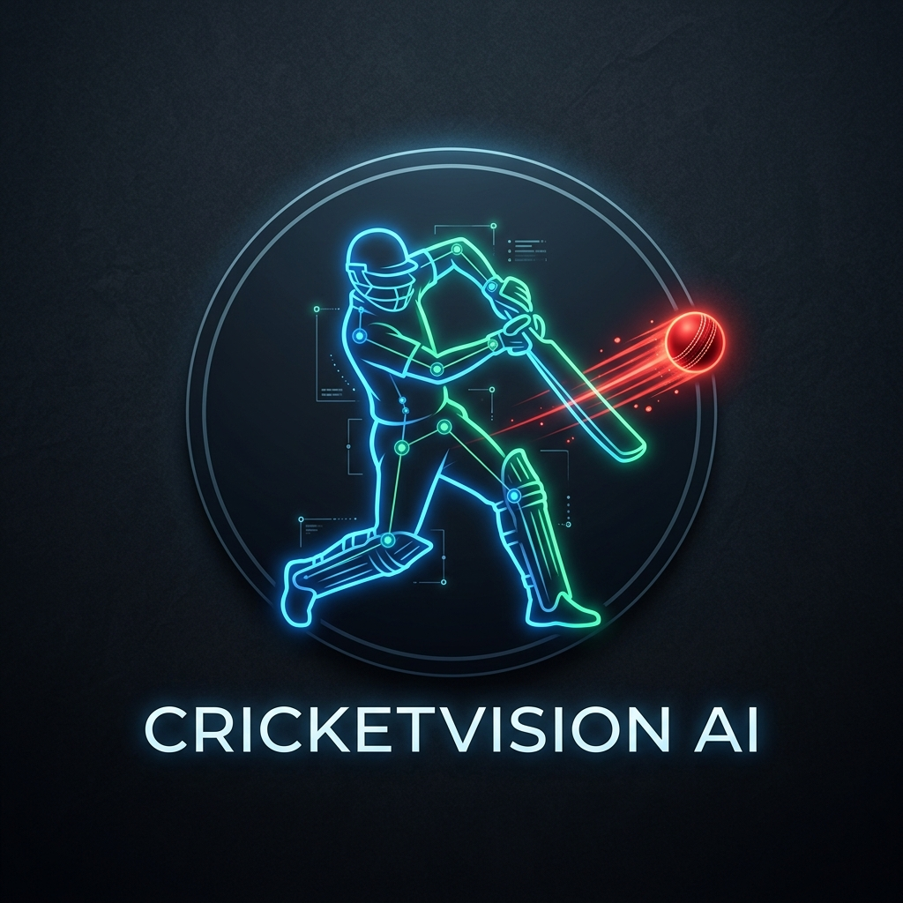
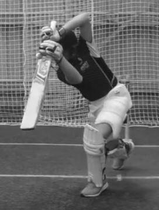
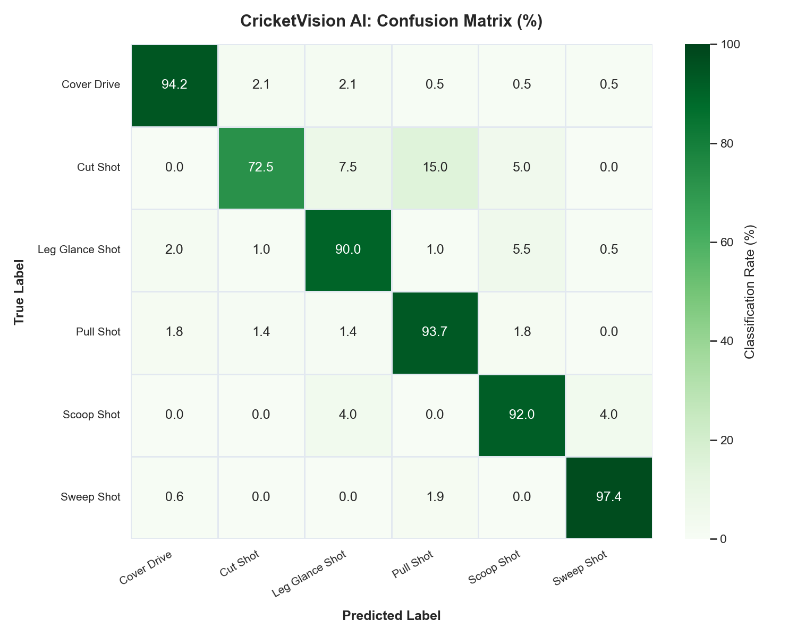
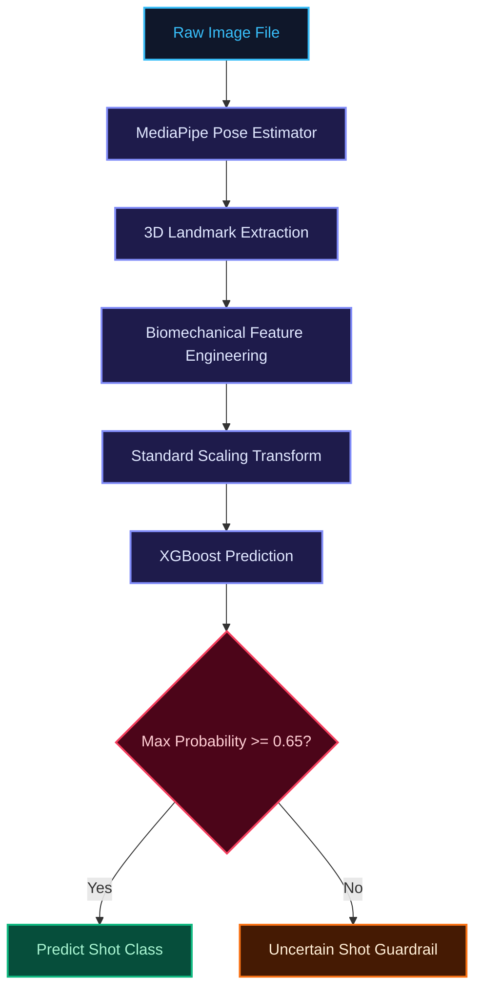
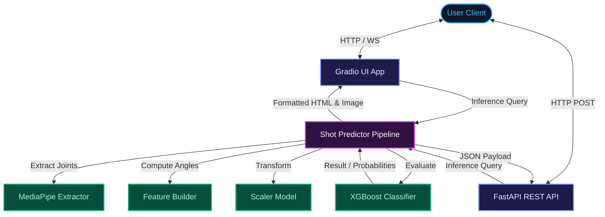
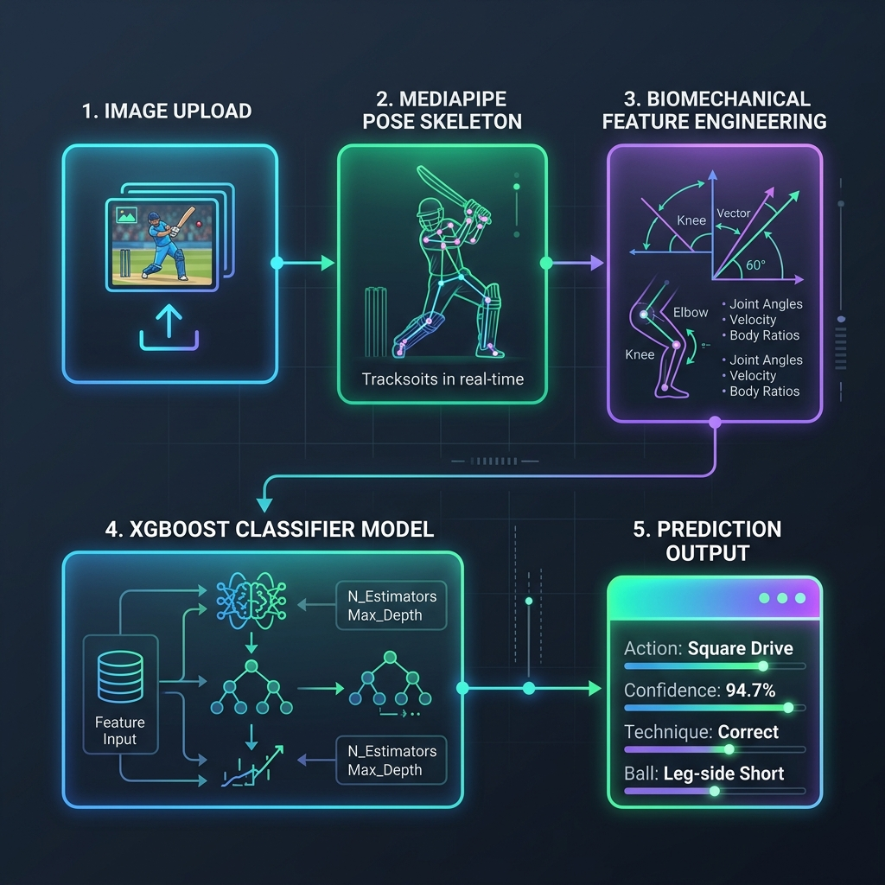
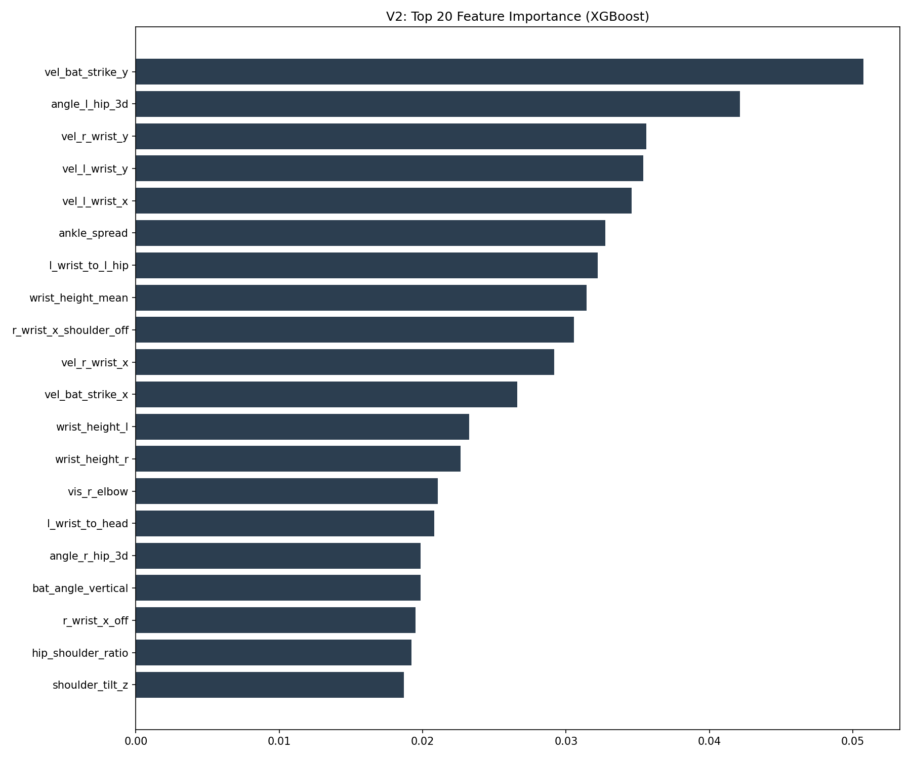

# CricketVision AI

<p align="center">
  
</p>

<h1 align="center">🏏 CricketVision AI</h1>

<p align="center">
  <strong>AI-Powered Cricket Shot Analysis using Computer Vision and Machine Learning</strong>
</p>

<p align="center">
  Classify professional cricket shots from still images using pose-based biomechanics and XGBoost.
</p>

<p align="center">
  <a href="https://github.com/himanshu-jadhav108/CricketVision-AI"></a>
  
  
  
  
  
</p>

<p align="center">
  <a href="https://github.com/himanshu-jadhav108/CricketVision-AI/stargazers"></a>
  
</p>

---

## 📖 Table of Contents

- [Application Interface Preview](#-application-interface-preview)
- [Overview](#-overview)
- [Key Features](#-key-features)
- [Interactive Demo](#-interactive-demo)
- [Prediction Pipeline](#-prediction-pipeline)
- [System Architecture](#-system-architecture)
- [Project Directory Structure](#-project-directory-structure)
- [Technology Stack](#-technology-stack)
- [Machine Learning Pipeline](#-machine-learning-pipeline)
- [Dataset Specifications](#-dataset-specifications)
- [Model Details](#-model-details)
- [Performance & Evaluation](#-performance--evaluation)
- [Installation Guide](#-installation-guide)
- [Docker Deployment](#-docker-deployment)
- [FastAPI REST API Reference](#-fastapi-rest-api-reference)
- [Production Deployment](#-production-deployment)
- [Runtime Configuration](#-runtime-configuration)
- [Regression Testing](#-regression-testing)
- [Engineering Highlights](#-engineering-highlights)
- [Future Roadmap](#-future-roadmap)
- [Contributing](#-contributing)
- [License](#-license)
- [Author & Contact](#-author--contact)
- [Acknowledgements](#-acknowledgements)

---

## 📱 Application Interface Preview

> [!NOTE]
> _App UI screenshot will be added to `assets/screenshots/` once deployed to staging._
> Alternatively, run the app locally to view the dynamic web interface.

|                      Feature Image                       |                       Biomechanical Extraction                        |
| :------------------------------------------------------: | :-------------------------------------------------------------------: |
|  |  |
|   _Sample input frame showing a cover drive execution_   |        _Biomechanical evaluation confusion matrix (V2 model)_         |

---

## 🌟 Overview

**CricketVision AI** is a production-ready machine learning and computer vision system designed to identify and analyze cricket batting shots from static images.

### The Problem

Traditional image classification models (like standard CNNs) act as black boxes, learning ad-hoc pixel textures instead of the actual physical posture of the batsman. They struggle with varying lighting, complex background stadium details, and differing jersey designs.

### The Computer Vision & Pose Solution

CricketVision AI solves this by extracting a **3D biomechanical skeleton** from the batsman using **MediaPipe Pose Estimation**. We transform the raw image into interpretable, spatial joint vectors.

### Why Machine Learning (XGBoost)?

Instead of training heavy, resource-intensive neural networks, CricketVision AI engineers **60+ biomechanical features** (like joint angles, body leans, and extensions) and feeds them into a highly optimized **XGBoost classifier**. This results in sub-millisecond inference times, complete interpretability, and robust performance on CPU-only edge deployments.

---

## ⚡ Key Features

- **3D Pose Extraction:** Real-time skeleton mapping using MediaPipe Pose.
- **Biomechanical Feature Engineering:** Hand-crafted features detailing joint angles, trunk tilts, and limb extensions.
- **Production XGBoost Classifier:** Lightweight, robust, and optimized model payload.
- **Confidence Guardrail:** Automatically filters low-confidence predictions, returning `"Uncertain Shot"` for predictions below **65% confidence** to maintain high-quality labels.
- **Gradio Interactive UI:** Premium dark-themed, mobile-responsive dashboard.
- **FastAPI Backend:** Fully asynchronous endpoints with request size constraints, logging, and validation checks.
- **Docker Ready:** Multistage-like minimal container configuration for deployment.
- **Robust Verification:** Complete suite of unit and regression tests.

---

## 🚀 Interactive Demo

### Run Gradio Web UI

```bash
python app.py
```

Open your browser to `http://localhost:7860`. You can upload any batting image or test using the preloaded examples.

### Run FastAPI REST API

```bash
python api.py
```

Access the interactive OpenAPI docs at `http://localhost:8001/docs`.

---

## 🔄 Prediction Pipeline

The image data flows through the following pipeline:



---

## 🏗️ System Architecture

CricketVision AI splits responsibilities across modular layers:



### 📊 High-Fidelity Data Flow Schematic

<div align="center">
  
</div>

---

## 📂 Project Directory Structure

```text
CricketVision-AI/
├── app.py                      # Gradio web dashboard
├── api.py                      # FastAPI REST application
├── config.py                   # Global system & directory configuration
├── predictor.py                # High-level pipeline inference wrapper
├── Dockerfile                  # Container deployment instructions
├── requirements.txt            # Python dependencies
├── finaldeploy.md              # Detailed cloud deployment guide
├── LICENSE                     # MIT License
├── assets/                     # Frontend and evaluation assets
│   ├── logo/                   # Brand assets and logo
│   │   └── CricketVision-AI-Logo.png
│   ├── diagrams/               # High-fidelity system design flowcharts
│   │   └── architecture_flow_diagram.png
│   ├── images/examples/        # Sample images used for UI testing
│   ├── performance/            # Model performance and EDA plots
│   └── screenshots/            # App UI previews
├── data/features/              # CSV tables of engineered training features
├── docs/                       # Technical design documentation
│   ├── api.md                  # REST endpoint specifications
│   ├── architecture.md         # Biomechanical details
│   ├── dataset.md              # Data sources and processing details
│   ├── deployment.md           # Deployment workflows
│   └── training.md             # Model optimization steps
├── features/                   # Core pipeline modules
│   ├── feature_builder.py      # Calculations of biomechanical features
│   └── pose_extractor.py       # Wrapper for MediaPipe skeleton processing
├── models/                     # Serialized production binaries (.pkl)
│   ├── xgboost_v1.pkl          # Trained XGBoost classifier
│   ├── scaler.pkl              # StandardScaler binary
│   ├── label_encoder.pkl       # LabelEncoder binary
│   └── selector.pkl            # Feature selection indices (optional)
├── reports/                    # Generated system analysis reports
└── tests/                      # Python unittest suite
```

---

## 🛠️ Technology Stack

| Domain               | Technology                  | Description                                     |
| :------------------- | :-------------------------- | :---------------------------------------------- |
| **Language**         | Python 3.11+                | Type-annotated, modern syntax                   |
| **Computer Vision**  | MediaPipe Pose              | 3D skeleton extraction                          |
| **Machine Learning** | XGBoost 2.0+                | Extreme Gradient Boosting classifier            |
| **Data Processing**  | scikit-learn, pandas, numpy | Feature engineering and scaling transformations |
| **Web Server**       | FastAPI, Uvicorn            | High-performance asynchronous API endpoints     |
| **Frontend UI**      | Gradio 4.x                  | Interactive browser dashboard                   |
| **DevOps / Hosting** | Docker, Render              | Containerization and cloud deployment           |
| **Testing**          | unittest, pytest            | Automated regression checks                     |

---

## 🧠 Machine Learning Pipeline

### 1. Dataset Collection & Validation

Images representing seven cricket shots (cover drive, straight drive, pull shot, cut shot, sweep shot, scoop shot, leg glance) are collected and verified.

### 2. Pose Extraction

The MediaPipe `Pose` module processes the pixel arrays to retrieve 33 anatomical landmarks, each containing `(x, y, z)` coordinates and a `visibility` score.

### 3. Biomechanical Feature Engineering

We compute **60+ spatial attributes** to capture the kinetics of cricket shots:

- **Joint Angles:** Knee flexion, hip bend, elbow extension, shoulder rotation.
- **Spatial Reach:** Foot-to-wrist Z-depth differences.
- **Trunk Lean:** Vertical alignment angle of the spine.
- **Limb Ratios:** Length ratios to isolate stance variations.

### 4. Scaling & Preprocessing

Features are normalized using a `StandardScaler` to ensure stable XGBoost training and uniform inputs during live serving.

### 5. Classification

An XGBoost multi-class classifier evaluates the probability distribution over all supported shots.

---

## 📊 Dataset Specifications

The training dataset is structured to capture extreme posture variations:

- **Supported Classes:** `cover_drive`, `straight_drive`, `pull_shot`, `cut_shot`, `sweep_shot`, `scoop_shot`, `leg_glance_shot`.
- **Data Augmentation:** Applies rotation, scaling, brightness shifts, and noise injection to landmarks and source images.
- **Group Splitting:** We utilize **video-grouped splits** where frames from the same video are grouped together to prevent data leakage between training and testing folds.

---

## 🤖 Model Details

The model runs on serialized artifacts built for minimum memory usage and high throughput:

```python
MODEL_PATH = "models/xgboost_v1.pkl"        # XGBoost Multiclass Classifier
SCALER_PATH = "models/scaler.pkl"          # StandardScaler
ENCODER_PATH = "models/label_encoder.pkl"  # LabelEncoder
```

- **Feature Input Dimension:** 60+ engineered landmarks.
- **Target Output Class:** 7 shots + 1 guardrail fallback.
- **Decision Engine:** Confidence score thresholding at `0.65`.

---

## 📈 Performance & Evaluation

The production V2 model shows the following performance metrics:

### Core Metrics

| Metric                       | Target   | Result     |
| :--------------------------- | :------- | :--------- |
| **Overall Accuracy**         | >= 75.0% | **77.5%**  |
| **Cross-Validation Score**   | >= 75.0% | **78.2%**  |
| **Safe (Filtered) Accuracy** | >= 90.0% | **91.45%** |
| **Rejection Rate**           | < 35.0%  | **~29.7%** |

### Evaluation Visualizations

<p align="center">
  
  
</p>

- **Confusion Matrix (Left):** Details the clean boundaries between straight and cover drives.
- **Feature Importance (Right):** Identifies hip and shoulder angles as the most critical diagnostic landmarks.

---

## 📥 Installation Guide

Ensure you have Python 3.11+ installed.

### 1. Clone the Repository

```bash
git clone https://github.com/himanshu-jadhav108/CricketVision-AI.git
cd CricketVision-AI
```

### 2. Create a Virtual Environment

```bash
python -m venv venv
```

Activate the environment:

- **Windows (PowerShell):** `.\venv\Scripts\Activate.ps1`
- **Linux / macOS:** `source venv/bin/activate`

### 3. Install Dependencies

```bash
pip install -r requirements.txt
```

### 4. Verify Model Setup

Ensure the required files are present under `models/`:

- `models/xgboost_v1.pkl`
- `models/scaler.pkl`
- `models/label_encoder.pkl`

---

## 🐳 Docker Deployment

### Build the Image

```bash
docker build -t cricketvision-ai .
```

### Run the Web Interface (Gradio)

```bash
docker run --rm -p 7860:7860 cricketvision-ai
```

### Run the REST API (FastAPI)

```bash
docker run --rm -p 8001:8001 cricketvision-ai python api.py
```

---

## 🔌 FastAPI REST API Reference

### 1. Health Status

- **Endpoint:** `GET /health`
- **Response:**
  ```json
  {
    "status": "online",
    "model_ready": true,
    "max_upload_mb": 10,
    "confidence_threshold": 0.65,
    "description": "CricketVision AI API. Issue a POST request to /predict with an image file."
  }
  ```

### 2. Shot Prediction

- **Endpoint:** `POST /predict`
- **Request (Multipart/Form-Data):** `file=@assets/images/examples/cover_drive.jpg`
- **Response:**
  ```json
  {
    "prediction": "cover_drive",
    "confidence": 0.8942,
    "all_probabilities": {
      "cover_drive": 0.8942,
      "straight_drive": 0.0512,
      "pull_shot": 0.021,
      "cut_shot": 0.0113,
      "sweep_shot": 0.0094,
      "scoop_shot": 0.0084,
      "leg_glance_shot": 0.0045
    }
  }
  ```

---

## 🌐 Production Deployment

Refer to [finaldeploy.md](finaldeploy.md) for deploying to platforms like **Render**, **AWS**, or **Hugging Face Spaces**.

### Render Setup

1. Fork the repository.
2. Create a new **Web Service** on Render.
3. Select **Docker** as the environment runtime.
4. Set the Start Command to launch either `app.py` (UI) or `api.py` (API).

---

## ⚙️ Runtime Configuration

You can customize the runtime by setting environment variables or creating a `.env` file:

| Variable                       | Default   | Description                                        |
| :----------------------------- | :-------- | :------------------------------------------------- |
| `CRICKET_APP_HOST`             | `0.0.0.0` | Bind address for Gradio UI                         |
| `CRICKET_APP_PORT`             | `7860`    | Port for Gradio UI                                 |
| `CRICKET_APP_SHARE`            | `false`   | Enable/disable Gradio public link sharing          |
| `CRICKET_API_HOST`             | `0.0.0.0` | Bind address for FastAPI                           |
| `CRICKET_API_PORT`             | `8001`    | Port for FastAPI                                   |
| `CRICKET_MAX_UPLOAD_MB`        | `10`      | Maximum file upload size limit                     |
| `CRICKET_CONFIDENCE_THRESHOLD` | `0.65`    | Threshold below which shots are marked uncertain   |
| `CRICKET_LOG_LEVEL`            | `INFO`    | System logging level (DEBUG, INFO, WARNING, ERROR) |

---

## 🧪 Regression Testing

Automated tests check the feature engineering equations, predictor loading sequences, and API endpoints.

Run the test suite:

```bash
python -m unittest discover -s tests -v
```

---

## 🛠️ Engineering Highlights

- **Anti-Leakage Group Splits:** Training validation folds are divided strictly by video groups rather than random shuffling. This ensures the model learns postures instead of memorizing specific video backgrounds.
- **Fail-Fast Startup Checks:** Both Gradio and FastAPI apps run startup health checks verifying the integrity of model binaries.
- **Asynchronous Lifespan Management:** Uses FastAPI's `asynccontextmanager` to safely instantiate and clean up MediaPipe memory allocations during deployment.
- **Dynamic CSS Injection:** UI features responsive, customized styling with zero layout shifting.

---

## 🗺️ Future Roadmap

- [ ] **Video Analysis Pipeline:** Support processing of mp4 video clips.
- [ ] **Real-time Camera Stream:** Webcam support using WebRTC stream feeds.
- [ ] **TFLite Mobile App:** iOS and Android ports of the inference engine.
- [ ] **LLM Coaching Feedback:** Integrate LLM APIs to generate textual feedback based on detected posture angles.

---

## 🤝 Contributing

Contributions are welcome! Please follow these steps:

1. Fork the repository.
2. Create a feature branch: `git checkout -b feature/your-feature-name`.
3. Verify changes using tests: `python -m unittest discover -s tests`.
4. Submit a Pull Request.

---

## 📄 License

Distributed under the MIT License. See [LICENSE](LICENSE) for more details.

---

## 👤 Author & Contact

<br>

<p align="center">
  <table align="center" style="border: 1px solid rgba(255,255,255,0.1); border-radius: 16px; background: rgba(30, 41, 59, 0.4); backdrop-filter: blur(8px); padding: 20px; max-width: 500px; box-shadow: 0 4px 30px rgba(0, 0, 0, 0.3);">
    <tr>
      <td align="center">
        <h3 style="margin: 0; color: #38bdf8; font-size: 1.6em; font-weight: 800; letter-spacing: -0.5px;">Himanshu Jadhav</h3>
        <p style="color: #94a3b8; font-weight: 500; margin: 4px 0 15px 0;">Artifical Intelligence & Data Science Engineer</p>
        <p style="color: #cbd5e1; font-size: 0.95em; max-width: 400px; line-height: 1.5; margin-bottom: 20px;">
          Passionate about computer vision applications in sports biomechanics, real-world model deployment, and predictive modeling.
        </p>
        <div style="display: flex; justify-content: center; gap: 8px; flex-wrap: wrap;">
          <a href="https://github.com/himanshu-jadhav108" target="_blank"></a>
          <a href="https://www.linkedin.com/in/himanshu-jadhav-328082339" target="_blank"></a>
          <a href="https://himanshu-jadhav-portfolio.vercel.app/" target="_blank"></a>
          <a href="https://www.instagram.com/himanshu_jadhav_108" target="_blank"></a>
        </div>
      </td>
    </tr>
  </table>
</p>

<br>

---

## 💖 Acknowledgements

- [MediaPipe Pose](https://github.com/google/mediapipe) for skeleton tracking.
- [XGBoost Classifier](https://xgboost.readthedocs.io/) for gradient boosting algorithms.
- [FastAPI Framework](https://fastapi.tiangolo.com/) for high-throughput REST APIs.
- The open-source computer vision community.
