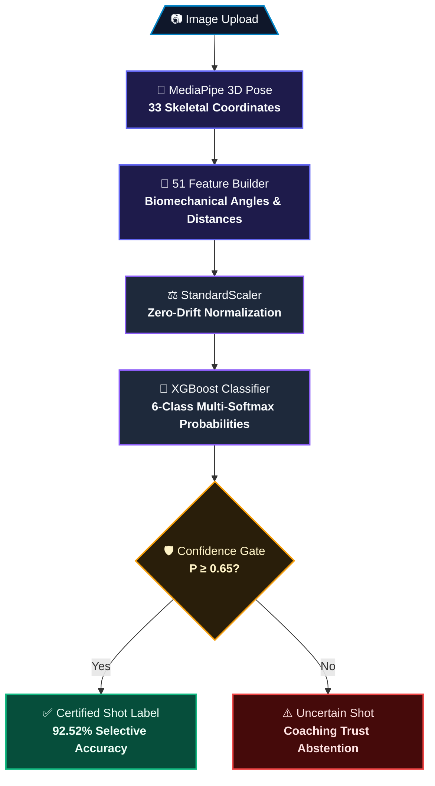
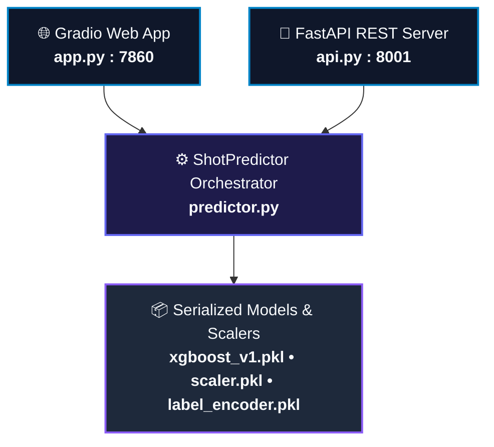

# Architecture

CricketVision AI is a modular inference system that classifies cricket batting shots from still images using pose-based biomechanical features and a trained XGBoost classifier.

## High-Level Flow

### 📊 High-Fidelity Data Flow Schematic

## Components

| Module | Role |
| :--- | :--- |
| [`app.py`](../app.py) | Gradio demo UI for interactive analysis |
| [`api.py`](../api.py) | FastAPI production endpoint |
| [`predictor.py`](../predictor.py) | End-to-end inference orchestration |
| [`config.py`](../config.py) | Centralised paths, thresholds, and environment settings |
| [`features/pose_extractor.py`](../features/pose_extractor.py) | MediaPipe Pose wrapper (33 landmarks) |
| [`features/feature_builder.py`](../features/feature_builder.py) | Biomechanical feature engineering (51 static features) |
| [`models/`](../models/) | Runtime model artifacts (`.pkl`) |

## Data Flow

1. **Input** — User uploads a cricket batting image (via Gradio UI or FastAPI).
2. **Pose Extraction** — MediaPipe Pose detects 33 body landmarks as `(x, y, z, visibility)`.
3. **Feature Engineering** — 51 static 3D biomechanical features are computed (joint angles, torso-scaled distances, Z-depth reach, and bat-vector angles).
4. **Preprocessing** — Features are standardized using the fitted `StandardScaler`.
5. **Classification** — XGBoost computes class probability distribution across six shot types.
6. **Guardrail** — Predictions below the 0.65 confidence threshold return `"Uncertain Shot"`.

## Deployment Topology

Both entry points share the same `ShotPredictor` class and read artifacts from `models/`.

## Design Principles

- **Single inference path** — UI and API use identical prediction logic.
- **Fail-fast startup** — Missing required artifacts prevent silent degradation.
- **Interpretable features** — Tabular biomechanics instead of black-box pixel models.
- **Confidence guardrail** — Low-confidence predictions are rejected rather than forced.

## Related Documentation

- [Training pipeline](training.md)
- [Dataset](dataset.md)
- [API reference](api.md)
- [Deployment guide](deployment.md)
