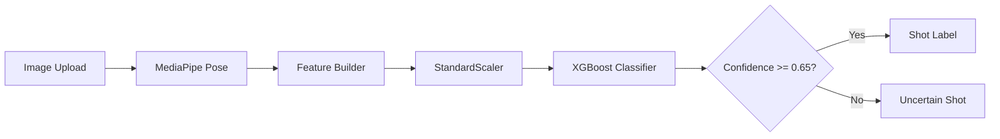

# Architecture

CricketVision AI is a modular inference system that classifies cricket batting shots from still images using pose-based biomechanical features and a trained XGBoost classifier.

## High-Level Flow



## Components

| Module | Role |
| :--- | :--- |
| [`app.py`](../app.py) | Gradio demo UI for interactive analysis |
| [`api.py`](../api.py) | FastAPI production endpoint |
| [`predictor.py`](../predictor.py) | End-to-end inference orchestration |
| [`config.py`](../config.py) | Centralised paths, thresholds, and environment settings |
| [`features/pose_extractor.py`](../features/pose_extractor.py) | MediaPipe Pose wrapper (33 landmarks) |
| [`features/feature_builder.py`](../features/feature_builder.py) | Biomechanical feature engineering (~60 features) |
| [`models/`](../models/) | Runtime model artifacts (`.pkl`) |

## Data Flow

1. **Input** — User uploads a cricket batting image (UI or API).
2. **Pose extraction** — MediaPipe detects 33 body landmarks as `(x, y, z, visibility)`.
3. **Feature engineering** — Joint angles, distances, Z-depth reach, bat-vector angles, and optional temporal velocity features are computed.
4. **Preprocessing** — Features are scaled with the fitted `StandardScaler`.
5. **Optional selection** — If a compatible `selector.pkl` is provided and feature widths match, feature pruning is applied.
6. **Classification** — XGBoost outputs class probabilities for seven shot types.
7. **Guardrail** — Predictions below the 65% confidence threshold return `"Uncertain Shot"`.

## Deployment Topology

```text
┌─────────────────┐     ┌──────────────────┐
│  Gradio UI      │     │  FastAPI API     │
│  (app.py:7860)  │     │  (api.py:8001)   │
└────────┬────────┘     └────────┬─────────┘
         │                       │
         └───────────┬───────────┘
                     ▼
            ┌─────────────────┐
            │  ShotPredictor  │
            └────────┬────────┘
                     ▼
            ┌─────────────────┐
            │  models/*.pkl   │
            └─────────────────┘
```

Both entry points share the same `ShotPredictor` class and read artifacts from `models/`.

## Design Principles

- **Single inference path** — UI and API use identical prediction logic.
- **Fail-fast startup** — Missing required artifacts prevent silent degradation.
- **Interpretable features** — Tabular biomechanics instead of black-box pixel models.
- **Confidence guardrail** — Low-confidence predictions are rejected rather than forced.

## Related Documentation

- [Training pipeline](training.md)
- [Dataset](dataset.md)
- [API reference](api.md)
- [Deployment guide](deployment.md)
